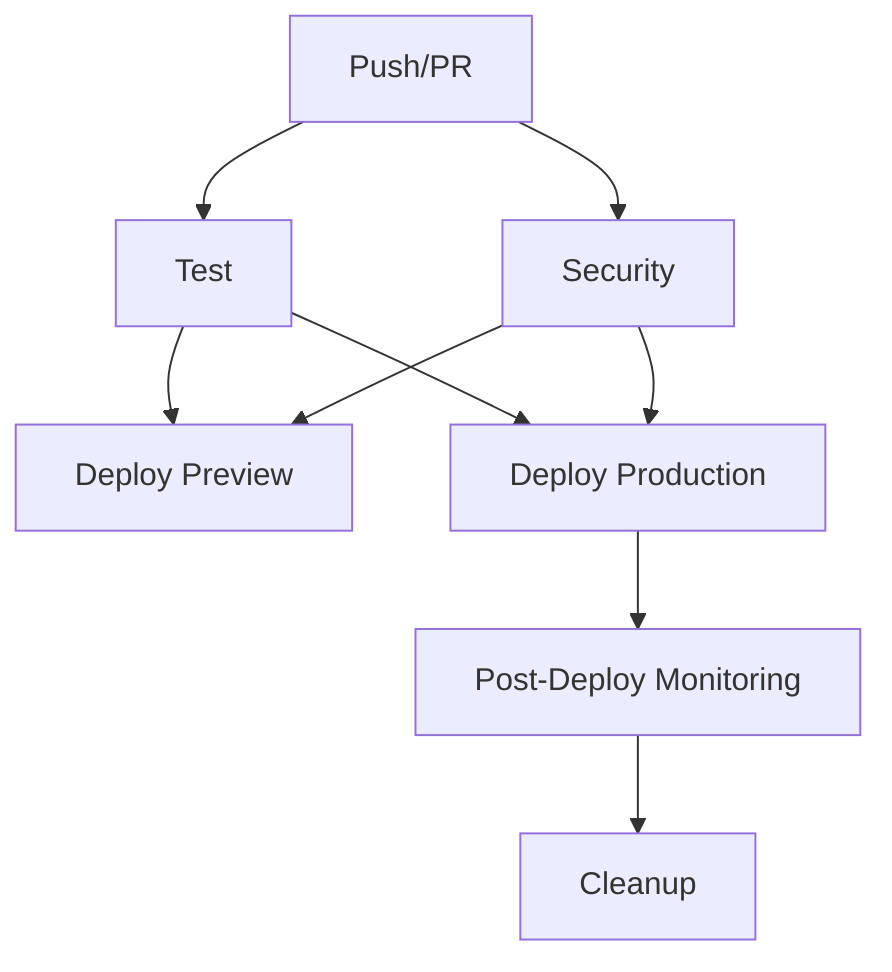

# 🚀 Pipeline de CI/CD - Sistema VNG v3

## Visão Geral

O Sistema VNG v3 utiliza GitHub Actions para implementar um pipeline completo de CI/CD (Continuous Integration/Continuous Deployment) que garante qualidade de código, segurança e deploy automatizado.

## 📋 Estrutura do Pipeline

### 1. Workflows Principais

#### `deploy.yml` - Pipeline de Deploy
- **Trigger**: Push para `main`/`master` e Pull Requests
- **Ambientes**: Preview (PRs) e Production (main)
- **Plataforma**: Vercel

#### `quality.yml` - Pipeline de Qualidade
- **Trigger**: Push, PRs e execução diária (2:00 AM UTC)
- **Foco**: Testes, segurança, performance e análise de código

### 2. Jobs do Pipeline de Deploy



#### **Test Job**
- ✅ Instalação de dependências
- ✅ Linting (ESLint)
- ✅ Type checking (TypeScript)
- ✅ Testes unitários
- ✅ Build da aplicação

#### **Security Job**
- 🔒 Análise de vulnerabilidades (Trivy)
- 🔒 Upload para GitHub Security tab
- 🔒 Verificação de dependências

#### **Deploy Preview Job** (apenas PRs)
- 🚀 Deploy para ambiente de preview
- 💬 Comentário automático no PR com URL
- 📊 Informações do deploy

#### **Deploy Production Job** (apenas main/master)
- 🚀 Deploy para produção
- ✅ Health checks pós-deploy
- 🔍 Verificações SSL e HTTPS
- 📈 Notificações de status

#### **Post-Deploy Monitoring Job**
- 🔍 Testes de fumaça
- ⚡ Verificação de performance
- 🚨 Criação de issues em caso de falha

#### **Cleanup Job**
- 🧹 Limpeza de deployments antigos
- 📊 Atualização de métricas

### 3. Jobs do Pipeline de Qualidade

#### **Code Analysis**
- 📝 ESLint com relatórios
- 🎨 Prettier check
- 📘 TypeScript compilation
- 📊 Upload de relatórios

#### **Unit Tests**
- 🧪 Testes em Node.js 18 e 20
- 📊 Coverage reports
- 📈 Upload para Codecov

#### **Integration Tests**
- 🐘 PostgreSQL test database
- 🔗 Testes de integração completos
- 🗄️ Migrações de banco

#### **E2E Tests**
- 🎭 Playwright tests
- 🖥️ Testes em múltiplos browsers
- 📸 Screenshots e vídeos

#### **Security Analysis**
- 🔍 npm audit
- 🛡️ Snyk security scan
- 🔒 Trivy vulnerability scanner
- 📋 SARIF reports

#### **Performance Analysis**
- 📦 Bundle size analysis
- 🚀 Lighthouse CI
- ⚡ Core Web Vitals

#### **Dependency Analysis**
- 📦 Outdated packages check
- 🧹 Unused dependencies
- 💰 Package cost analysis

## 🔧 Configuração

### 1. Secrets Necessários

Configure os seguintes secrets no GitHub:

```bash
# Vercel
VERCEL_TOKEN=your_vercel_token
VERCEL_ORG_ID=your_org_id
VERCEL_PROJECT_ID=your_project_id

# Supabase
NEXT_PUBLIC_SUPABASE_URL=your_supabase_url
NEXT_PUBLIC_SUPABASE_ANON_KEY=your_supabase_anon_key
SUPABASE_SERVICE_ROLE_KEY=your_service_role_key

# NextAuth
NEXTAUTH_SECRET=your_nextauth_secret
NEXTAUTH_URL=https://sistemavng.com.br

# Bling API
BLING_CLIENT_ID=your_bling_client_id
BLING_CLIENT_SECRET=your_bling_client_secret

# Segurança (opcional)
SNYK_TOKEN=your_snyk_token
```

### 2. Configuração do Vercel

```bash
# Instalar Vercel CLI
npm install -g vercel

# Login no Vercel
vercel login

# Configurar projeto
vercel link

# Obter IDs necessários
vercel env ls
```

### 3. Scripts Package.json

Adicione os seguintes scripts ao `package.json`:

```json
{
  "scripts": {
    "dev": "next dev",
    "build": "next build",
    "start": "next start",
    "lint": "next lint",
    "lint:fix": "next lint --fix",
    "type-check": "tsc --noEmit",
    "format": "prettier --write .",
    "format:check": "prettier --check .",
    "test": "jest",
    "test:watch": "jest --watch",
    "test:coverage": "jest --coverage",
    "test:integration": "jest --config jest.integration.config.js",
    "test:e2e": "playwright test",
    "analyze": "cross-env ANALYZE=true next build",
    "db:migrate": "supabase db push",
    "db:migrate:test": "supabase db push --db-url $DATABASE_URL"
  }
}
```

## 🚦 Fluxo de Trabalho

### 1. Desenvolvimento

```bash
# 1. Criar branch feature
git checkout -b feature/nova-funcionalidade

# 2. Desenvolver e testar localmente
npm run dev
npm run test
npm run lint

# 3. Commit e push
git add .
git commit -m "feat: adicionar nova funcionalidade"
git push origin feature/nova-funcionalidade
```

### 2. Pull Request

1. **Criar PR** no GitHub
2. **Pipeline automático** executa:
   - Testes de qualidade
   - Deploy de preview
   - Análise de segurança
3. **Review** do código
4. **Merge** após aprovação

### 3. Deploy para Produção

1. **Merge para main** dispara:
   - Build de produção
   - Deploy no Vercel
   - Health checks
   - Monitoramento

## 📊 Monitoramento e Alertas

### 1. GitHub Actions

- ✅ Status checks obrigatórios
- 📧 Notificações por email
- 🔔 Integração com Slack/Discord

### 2. Vercel Dashboard

- 📈 Métricas de performance
- 🚀 Logs de deploy
- 🔍 Analytics

### 3. Lighthouse CI

- ⚡ Core Web Vitals
- 📊 Performance scores
- 🎯 Regression detection

## 🛠️ Troubleshooting

### Problemas Comuns

#### 1. Falha no Deploy

```bash
# Verificar logs
vercel logs sistemavng.com.br

# Rollback se necessário
vercel rollback sistemavng.com.br
```

#### 2. Testes Falhando

```bash
# Executar testes localmente
npm run test
npm run test:integration
npm run test:e2e

# Verificar coverage
npm run test:coverage
```

#### 3. Problemas de Segurança

```bash
# Verificar vulnerabilidades
npm audit
npm audit fix

# Análise com Snyk
npx snyk test
npx snyk wizard
```

### Logs e Debugging

#### GitHub Actions
- Acesse: `https://github.com/seu-usuario/sistemavng-v3/actions`
- Visualize logs detalhados de cada job
- Download de artifacts para análise

#### Vercel
- Dashboard: `https://vercel.com/dashboard`
- Logs em tempo real
- Métricas de performance

## 🔄 Atualizações e Manutenção

### 1. Dependências

```bash
# Verificar atualizações
npm outdated

# Atualizar dependências
npm update

# Verificar vulnerabilidades
npm audit
```

### 2. Pipeline

- Revisar workflows mensalmente
- Atualizar actions para versões mais recentes
- Monitorar performance dos jobs

### 3. Métricas

- Acompanhar tempo de build
- Monitorar taxa de sucesso
- Analisar feedback de qualidade

## 📚 Recursos Adicionais

- [GitHub Actions Documentation](https://docs.github.com/en/actions)
- [Vercel Documentation](https://vercel.com/docs)
- [Lighthouse CI](https://github.com/GoogleChrome/lighthouse-ci)
- [Playwright Testing](https://playwright.dev/)
- [Jest Testing Framework](https://jestjs.io/)

## 🤝 Contribuição

Para contribuir com melhorias no pipeline:

1. Abra uma issue descrevendo a melhoria
2. Crie um PR com as alterações
3. Teste em ambiente de desenvolvimento
4. Documente as mudanças

---

**Última atualização:** $(date)
**Versão:** 1.0.0